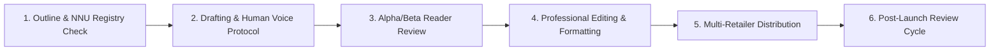

# 🏛️ AUTHOR BUSINESS OPERATING SYSTEM (ABOS)
## Master Operational Manual & Enterprise Execution Blueprint for Nobi Kumar & NNU

> **Document Target:** `docs/project/AUTHOR_BUSINESS_OPERATING_SYSTEM.md`  
> **Status:** Official Master Operating Manual  
> **Author Enterprise:** Nobi Kumar (Nobi Narrative Universe - NNU)  
> **Prepared By:** Executive Leadership Council (CEO, COO, CTO, CPO, Heads of Marketing, Growth, Security & Analytics)

---

## 📑 EXECUTIVE SUMMARY & ENTERPRISE VISION

The **Author Business Operating System (ABOS)** transforms Nobi Kumar from a solo fiction writer into an automated, direct-to-reader digital publishing powerhouse. By operating like a modern tech-enabled media company, ABOS aligns content creation, reader acquisition, multi-retailer distribution, digital product commerce, community retention, and financial sustainability under a single unified governance structure.

```
                         ┌─────────────────────────────────┐
                         │      NOBI KUMAR AUTHOR BRAND    │
                         └────────────────┬────────────────┘
                                          │
       ┌──────────────────────────────────┼──────────────────────────────────┐
       ▼                                  ▼                                  ▼
┌──────────────┐                  ┌──────────────┐                  ┌──────────────┐
│  PUBLISHING  │                  │  TECHNOLOGY  │                  │   FINANCE &  │
│  & CONTENT   │                  │  & PLATFORM  │                  │  OPERATIONS  │
│ (Books, NNU) │                  │(Site, CRM)   │                  │(Direct, Sub) │
└──────────────┘                  └──────────────┘                  └──────────────┘
```

---

## 🏛️ SECTION 1: C-SUITE GOVERNANCE & ROLES

### 1.1 Executive Responsibilities Matrix
- **CEO (Nobi Kumar / Lead):** Sets creative vision, approves canon novel plots, oversees global licensing deals, and acts as the public voice of NNU.
- **COO (Chief Operating Officer):** Manages book launch timelines, vendor relationships (print houses, translators, narrators), legal compliance, and customer support.
- **CTO & Lead Architect:** Maintains web platform availability (99.99% uptime SLA), security posture, database backups, and payment gateway health.
- **CPO & UX Lead:** Enforces dark academia/psychological thriller visual branding, reader onboarding funnels, and mobile reading experience.
- **Head of Growth & Marketing:** Manages reader acquisition funnels, Amazon ad campaigns, social media content engines, and email list expansion.

---

## 📖 SECTION 2: PUBLISHING & CREATIVE OPERATING SYSTEM

### 2.1 The NNU Canon Creation Cycle
Every novel entering the Nobi Narrative Universe follows a strict 6-stage lifecycle:



1. **Phase 1: Concept & Canon Alignment:** Verify character cross-appearances against `character_registry_global.md` and timeline events against `timeline_registry_global.md`.
2. **Phase 2: Drafting Protocol:** Enforce `human_voice_rulebook.md` (zero AI banned words, natural conversational rhythm, visceral tension).
3. **Phase 3: Alpha/Beta Reader Review:** Distribute encrypted digital galleys via Ko-fi VIP member channels.
4. **Phase 4: Production Editing:** Structural editing, proofreading, and multi-format formatting (ePub, PDF, MOBI, Print PDF).
5. **Phase 5: Global Distribution:** Upload to KDP (IN/US), Kobo, Google Play, Apple Books, IngramSpark, Pocket FM, and Audible.
6. **Phase 6: 14-Day Automated Review Collector:** Trigger post-read emails inviting readers to submit verified Amazon reviews.

---

## 💰 SECTION 3: REVENUE ENGINE & RETAILER SYNDICATION

### 3.1 Multi-Tiered Monetization Streams
1. **Direct Book Purchases:** Amazon India (IN), Amazon Global (US/UK/EU), Kobo, Apple Books, Google Play.
2. **Serialized Audiobooks:** Pocket FM & Kuku FM referral commission models for Indian listeners.
3. **Affiliate Marketing Engine:** Amazon Associates (`nobikumar-21` & `nobikumar-20`) embedded across book pages and resources.
4. **Digital Lore Commerce:** Ko-fi / Gumroad direct sales of NNU Master Maps, Character Bibles, and Suspense Plotting Templates (90%+ profit margin).
5. **Recurring VIP Subscriptions ("The Verma Society"):**
   - **Novice Reader ($3/mo):** Supporter wall credit + early blog access.
   - **Insider Investigator ($7/mo):** 1-month early unedited chapter drafts + map downloads.
   - **NNU Patron ($15/mo):** Printed book acknowledgments + signed paperback upon launch.

---

## 📥 SECTION 4: MARKETING, CRM & READER LIFECYCLE

### 4.1 The 7-Stage Reader Lifecycle Funnel
```
[1. Visitor] ──> [2. Sample Reader] ──> [3. Email Subscriber] ──> [4. Retailer Buyer]
                                                                        │
[7. NNU Superfan] <── [6. VIP Club Member] <── [5. Verified Reviewer] <─┘
```

### 4.2 Automated Email Nurture Sequence
- **Day 0 (Instant):** Deliver requested eBook sample PDF + Welcome note from Nobi.
- **Day 3:** "The Real Inspiration Behind the St. Jude Stairwell Fall".
- **Day 5:** "Explore the NNU Universe Map & Hidden Clues".
- **Day 7:** Special Amazon 1-Click Buy Link + Reader Discount Code.

---

## 🔒 SECTION 5: TECHNICAL PLATFORM & SECURITY GOVERNANCE

### 5.1 System Architecture & SLA Requirements
- **Hosting:** Next.js 16 App Router hosted on Vercel Edge Network.
- **Database:** PostgreSQL on Neon / AWS RDS managed via Prisma ORM.
- **Cache & Analytics:** Redis for query caching; custom event logger for zero-cookie analytics.
- **Security SLA:** 
  - OWASP Top 10 compliance.
  - Zero plain-text credentials (secrets stored in AWS Secrets Manager / Vercel Env).
  - Daily encrypted database backups stored in isolated AWS S3 buckets.
  - Strict HTTP-only, SameSite=Strict session cookies.

---

## 📈 SECTION 6: FINANCIAL OPERATING SYSTEM & KPI DASHBOARD

### 6.1 Core Business Metrics (Monthly Review)
- **MRR (Monthly Recurring Revenue):** Track VIP membership subscriptions.
- **ARPU (Average Revenue Per User):** Total revenue divided by active email list size.
- **LTV (Reader Lifetime Value):** Average book + merch purchases over 24 months.
- **CAC (Customer Acquisition Cost):** Ad spend on Amazon/Meta divided by new buyers acquired.
- **Email List Growth Rate:** Net subscriber additions per month (Target: >15% MoM).

### 6.2 Revenue Benchmark Goals
- **10,000 Monthly Visitors:** Target ~$1,160 / month ($13,900 / year).
- **50,000 Monthly Visitors:** Target ~$12,600 / month ($151,000 / year).
- **100,000 Monthly Visitors:** Target ~$26,000 / month ($312,000 / year).

---

## 📝 SECTION 7: OPERATIONAL CHECKLISTS

### Launch Day Checklist (New Book Release)
- [ ] Upload final proofed manuscript to Amazon KDP, Kobo, Google Play, Apple Books.
- [ ] Create new `Book` entry in website admin panel with all regional retailer affiliate links.
- [ ] Send broadcast newsletter announcement to email subscribers.
- [ ] Post interactive lore teaser on Instagram/X linking to `/books/[slug]`.
- [ ] Activate automated 14-day review collection campaign for the new title.
