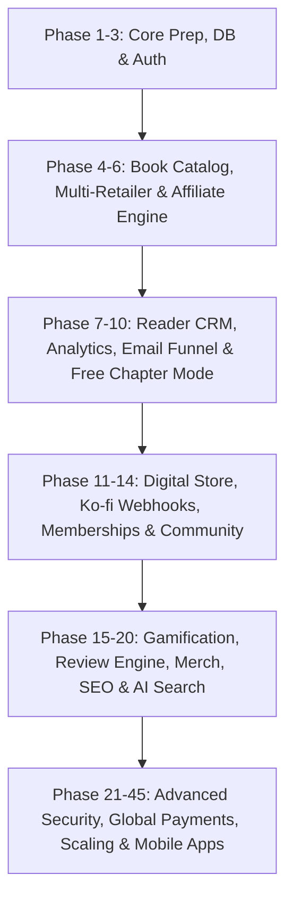

# 🗺️ MASTER MONETIZATION & PLATFORM IMPLEMENTATION PLAN (NOBI KUMAR v2.0)
## Production Execution Roadmap: 45 Detailed Phases, Complete Task Breakdown, Dependencies, and Release Plan

> **File Target:** `docs/project/MASTER_MONETIZATION_IMPLEMENTATION_PLAN.md`  
> **Status:** Official Master Production Roadmap  
> **Role:** Principal Solutions Architect, Staff PM, Lead Full-Stack Engineer, Analytics & Growth Architect  
> **Execution Strategy:** Strict dependency-sequenced engineering phases to transform Nobi Kumar's author platform into an enterprise direct-to-reader digital publishing business.

---

## 🎯 Executive Overview & Critical Path

---

## 📋 PHASE 1: Project Preparation, Repository Standards & CI/CD Pipeline
- **Objective:** Establish production-grade Next.js 16 (Turbopack) setup, ESLint/Prettier rules, environment secrets management, and automated GitHub Actions CI/CD workflows.
- **Business Value:** Prevents regression bugs, enforces code quality standards, and enables 1-click deployments to Vercel/AWS.
- **Dependencies:** None (Baseline Setup).
- **Time Estimate:** 3 Days.

### Tasks & Technical Blueprint
- [ ] **Backend/Repo:** Enforce Node.js v20+ LTS, pnpm workspace, and `.env.example` validation via Zod.
- [ ] **CI/CD:** Configure `.github/workflows/ci.yml` running linting, TypeScript type-check, Prisma schema validation, and Jest/Playwright tests on PR.
- [ ] **Security:** Set up Dependabot scanning, secret detection, and strict `.gitignore` rules.
- [ ] **Acceptance Criteria:** CI pipeline passes 100% cleanly on main branch; environment variables validated on startup.

---

## 📋 PHASE 2: Core Database Schema & Multi-Retailer Entity Modeling
- **Objective:** Model Books, Authors, Series, Retailers, Media, and Categories in Prisma PostgreSQL.
- **Business Value:** Provides foundational data architecture for books, sample chapters, and retailer links.
- **Dependencies:** Phase 1.
- **Time Estimate:** 4 Days.

### Tasks & Technical Blueprint
- [ ] **Prisma Schema:** Create `Book`, `Series`, `Author`, `Category`, `Tag`, `RetailerLink`, and `MediaAsset` models.
- [ ] **Migrations:** Run `npx prisma migrate dev --name init_catalog_models`.
- [ ] **API Services:** Implement `BookRepository` and `BookService` with cached queries using Redis/Next.js cache tags.
- [ ] **Acceptance Criteria:** Database seeds 7 NNU novel titles and relationships cleanly without foreign key constraints failing.

---

## 📋 PHASE 3: Authentication & Multi-Role Authorization (Reader + Admin)
- **Objective:** Implement NextAuth.js / Supabase Auth with OAuth 2.0 (Google, Apple) and Role-Based Access Control (RBAC).
- **Business Value:** Enables personalized reader profiles, wishlist persistence, and secure admin dashboard management.
- **Dependencies:** Phase 2.
- **Time Estimate:** 5 Days.

### Tasks & Technical Blueprint
- [ ] **Backend:** Implement JWT session management, RBAC middleware (`READER`, `MODERATOR`, `ADMIN`).
- [ ] **Frontend:** Build `/admin/login` and `<UserMenu />` headers with OAuth triggers.
- [ ] **Security:** Enforce HTTP-only, SameSite=Strict cookies and CSRF protection.
- [ ] **Acceptance Criteria:** Readers log in via Google/Email; non-admin users blocked from `/admin/*` routes with 403 Forbidden.

---

## 📋 PHASE 4: Dynamic Book Catalog, Series & Reading Order Engine
- **Objective:** Build responsive `/books`, `/books/[slug]`, and interactive Verma Saga Reading Order UI components.
- **Business Value:** Guides new visitors through the Nobi Narrative Universe entry points and increases book discovery.
- **Dependencies:** Phase 2, Phase 3.
- **Time Estimate:** 4 Days.

### Tasks & Technical Blueprint
- [ ] **UI Components:** Build 3D Book Cover perspective component (`Book3DCover.tsx`), series volume badges, and synopsis tabs.
- [ ] **Pages:** Build `/books/page.tsx` and `/books/[slug]/page.tsx` with dynamic Next.js static params.
- [ ] **Acceptance Criteria:** Fast page load (<1.2s LCP); persistent left navigation bar on book detail view.

---

## 📋 PHASE 5: Smart Multi-Retailer Engine & Geo-IP Location Router
- **Objective:** Auto-detect visitor location (India vs US/UK/EU) and device type (iOS/Android/Kindle) to surface optimal buy buttons.
- **Business Value:** Maximizes conversion rates by routing readers directly to their native store (Amazon IN, Amazon US, Pocket FM, Audible, Apple Books, Kobo).
- **Dependencies:** Phase 4.
- **Time Estimate:** 5 Days.

### Tasks & Technical Blueprint
- [ ] **Backend/API:** Build `/api/geo` endpoint using Vercel Geo-IP / Cloudflare headers.
- [ ] **Frontend:** Render `<SmartRetailerButtons />` displaying regional primary store + secondary options drawer.
- [ ] **Fallback Logic:** Default to Amazon US for unknown international locations; default to Amazon India for IN IPs.
- [ ] **Acceptance Criteria:** Visitors from India see INR prices and Amazon.in/Pocket FM first; US visitors see USD and Amazon.com/Audible.

---

## 📋 PHASE 6: Smart Affiliate Engine & Mandatory Compliance Tracker
- **Objective:** Dynamically append affiliate tags (`tag=nobikumar-21` / `nobikumar-20`) to all outgoing retailer links and log click events.
- **Business Value:** Captures 4%–10% passive affiliate commissions while keeping full compliance with Amazon Associates rules.
- **Dependencies:** Phase 5.
- **Time Estimate:** 3 Days.

### Tasks & Technical Blueprint
- [ ] **Backend:** Create `AffiliateClickLog` Prisma table and `/api/affiliate/track` beacon.
- [ ] **Compliance UI:** Render Amazon Associate Disclaimer on all retailer buy modals and footer.
- [ ] **Acceptance Criteria:** Every outgoing Amazon link contains valid affiliate tag; click logs populated in DB.

---

## 📋 PHASE 7: Reader CRM, User Profiles & Reading Progress Persistence
- **Objective:** Build rich reader accounts tracking sample reading progress, favorite genres, wishlists, and mystery points.
- **Business Value:** Provides first-party reader data for targeted email marketing and lifetime value optimization.
- **Dependencies:** Phase 3, Phase 4.
- **Time Estimate:** 6 Days.

### Tasks & Technical Blueprint
- [ ] **Database:** Create `ReaderProfile`, `Wishlist`, and `ReadingProgress` models.
- [ ] **UI:** Build `/account/profile` dashboard displaying read books, unlocked badges, and saved chapters.
- [ ] **Acceptance Criteria:** Reader can bookmark sample chapter location and resume reading across devices.

---

## 📋 PHASE 8: Analytics Engine, Event Funnels & Revenue Dashboard
- **Objective:** Build privacy-first analytics pipeline tracking traffic, CTR, lead magnet conversions, and affiliate link clicks.
- **Business Value:** Gives Nobi Kumar real-time insight into top-performing books, landing pages, and revenue streams.
- **Dependencies:** Phase 6, Phase 7.
- **Time Estimate:** 5 Days.

### Tasks & Technical Blueprint
- [ ] **Backend:** Implement `/api/analytics/event` endpoint logging pageviews, sample reads, and buy link clicks.
- [ ] **Admin Dashboard:** Build `/admin/analytics` featuring Recharts graphs for conversion rates and revenue metrics.
- [ ] **Acceptance Criteria:** Real-time event logging without impacting Core Web Vitals (<50ms API overhead).

---

## 📋 PHASE 9: Email Marketing Automation & Lead Nurture Funnel
- **Objective:** Integrate ConvertKit / Mailchimp API to automate a 7-day email welcome sequence upon sample download.
- **Business Value:** Converts casual web traffic into loyal email subscribers and paying readers.
- **Dependencies:** Phase 7, Phase 8.
- **Time Estimate:** 4 Days.

### Tasks & Technical Blueprint
- [ ] **API Integration:** Connect ConvertKit API v3 webhooks for subscriber tagging (`tag: verma_saga_lead`).
- [ ] **Sequences:** Configure Day 0 (Sample PDF), Day 3 (Behind the Scenes), Day 5 (NNU Lore), and Day 7 (Amazon Discount Pitch).
- [ ] **Acceptance Criteria:** Email subscriber added within 2 seconds of entering email; double opt-in verification sent.

---

## 📋 PHASE 10: Distraction-Free Sample Reader Mode (`/books/[slug]/sample`)
- **Objective:** Build an immersive eBook reader UI for sample chapters featuring watermarking, progress saving, and post-chapter CTAs.
- **Business Value:** Drives maximum email sign-up conversion by delivering instant reading value.
- **Dependencies:** Phase 4, Phase 9.
- **Time Estimate:** 5 Days.

### Tasks & Technical Blueprint
- [ ] **UI Component:** Build `<SampleReaderUI />` with font size controls, dark/sepia/light themes, and progress bar.
- [ ] **Conversion Overlay:** Trigger email lead capture modal after Chapter 3 finish.
- [ ] **Acceptance Criteria:** Reader state preserved in local storage & database; smooth font scaling on mobile.

---

## 📋 PHASE 11: Digital Lore Shop & Asset Delivery Engine (PDFs, Maps, Bibles)
- **Objective:** Enable direct sales of high-res NNU universe maps, character art packs, and story bibles.
- **Business Value:** Generates 90%+ net profit digital product revenue.
- **Dependencies:** Phase 7, Phase 10.
- **Time Estimate:** 5 Days.

### Tasks & Technical Blueprint
- [ ] **Database:** Create `DigitalProduct`, `Order`, and `DownloadToken` models.
- [ ] **Delivery Engine:** Generate temporary 24-hour expiring S3/Cloudflare R2 download links upon successful purchase.
- [ ] **Acceptance Criteria:** Secure single-use download links delivered automatically to customer email.

---

## 📋 PHASE 12: Ko-fi Webhook Integration & Reader Support Engine
- **Objective:** Integrate Ko-fi API webhooks for direct reader tips, donations, and digital store purchases with 0% platform fees.
- **Business Value:** Collects direct reader support via PayPal, Stripe, and UPI without holding creator funds.
- **Dependencies:** Phase 11.
- **Time Estimate:** 3 Days.

### Tasks & Technical Blueprint
- [ ] **Webhook API:** Build `/api/webhooks/kofi` verifying secret key and granting mystery points/badges upon donation.
- [ ] **UI Widget:** Embed non-intrusive "Buy Nobi a Coffee ☕" button on `/universe` and footer.
- [ ] **Acceptance Criteria:** Webhook processes transactions in real time; updates reader profile status automatically.

---

## 📋 PHASE 13: VIP Reader Club & Membership Platform ("The Verma Society")
- **Objective:** Build multi-tiered VIP memberships ($3, $7, $15/month) granting early draft chapters, ARC access, and acknowledgments.
- **Business Value:** Provides predictable, recurring monthly subscriber revenue.
- **Dependencies:** Phase 12.
- **Time Estimate:** 6 Days.

### Tasks & Technical Blueprint
- [ ] **Access Control:** Build `<ProtectedMemberContent />` component unlocking exclusive chapter drafts based on VIP tier.
- [ ] **Admin Manager:** Build `/admin/subscribers` for managing tier perks and custom badges.
- [ ] **Acceptance Criteria:** Non-paying users seeing VIP posts receive a sleek tier upgrade preview banner.

---

## 📋 PHASE 14: Community Hub, Reader Discussions & Fan Theory Forum
- **Objective:** Create `/community` route for reader comments, mystery theory polls, and character discussion threads.
- **Business Value:** Fosters high reader retention and viral word-of-mouth engagement.
- **Dependencies:** Phase 3, Phase 7.
- **Time Estimate:** 6 Days.

### Tasks & Technical Blueprint
- [ ] **Database:** Create `DiscussionThread`, `Comment`, and `PollVote` Prisma models.
- [ ] **Moderation:** Build AI content safety filter & admin moderation queue (`/admin/comments`).
- [ ] **Acceptance Criteria:** Verified readers can post comments, upvote theories, and vote in monthly character polls.

---

## 📋 PHASE 15: Gamification Engine (Mystery Points & Collectible Badges)
- **Objective:** Reward reader engagement with Mystery Points (MP) and collectible profile badges (`Stairwell Witness`, `Verified Reviewer`).
- **Business Value:** Gamifies reading habits, increasing repeat visits and store conversions.
- **Dependencies:** Phase 7, Phase 14.
- **Time Estimate:** 4 Days.

### Tasks & Technical Blueprint
- [ ] **Engine:** Implement `GamificationService` awarding MP for sample reads, map exploration, and book reviews.
- [ ] **UI Badges:** Render animated SVG badges on reader profiles and community comment headers.
- [ ] **Acceptance Criteria:** Reader receives instant toast notification upon unlocking a new badge.

---

## 📋 PHASE 16: Automated Amazon Review Collection & Incentive Loop
- **Objective:** Automatically email readers 14 days post-sample read to request an Amazon/Goodreads review in exchange for exclusive lore PDFs.
- **Business Value:** Boosts book review count on Amazon India and Amazon US, driving higher organic search rank.
- **Dependencies:** Phase 9, Phase 15.
- **Time Estimate:** 4 Days.

### Tasks & Technical Blueprint
- [ ] **Scheduler:** Set up daily cron task scanning `ReviewLog` table for readers due for a review prompt.
- [ ] **Verification Page:** Build `/reviews/verify` allowing readers to submit their Amazon review link to claim rewards.
- [ ] **Acceptance Criteria:** Automated emails triggered cleanly; rewards unlocked upon review submission.

---

## 📋 PHASE 17: Merchandise Store & Signed Book Order Engine
- **Objective:** Build physical merch catalog for signed paperbacks, bookmarks, character art prints, and custom hoodies.
- **Business Value:** Unlocks premium physical commerce revenue for hardcore superfans.
- **Dependencies:** Phase 11.
- **Time Estimate:** 6 Days.

### Tasks & Technical Blueprint
- [ ] **E-commerce Engine:** Build cart drawer (`CartContext`), checkout flow via Razorpay / Stripe, and shipping address collection.
- [ ] **Admin Orders:** Build `/admin/orders` table for tracking package fulfillment and tracking numbers.
- [ ] **Acceptance Criteria:** Orders calculated with accurate tax and shipping fees; customer receives tracking email.

---

## 📋 PHASE 18: SEO Engine, Structured Schema & Knowledge Graph Optimization
- **Objective:** Implement JSON-LD schema (`Book`, `Author`, `WebPage`, `BreadcrumbList`), dynamic sitemaps, and OpenGraph images.
- **Business Value:** Dominates organic Google search results for Nobi Kumar, Verma Saga, and Indian thriller keywords.
- **Dependencies:** Phase 4, Phase 19.
- **Time Estimate:** 3 Days.

### Tasks & Technical Blueprint
- [ ] **Schema Builder:** Generate valid Schema.org `Book` and `Person` markup on all book detail routes.
- [ ] **Dynamic Sitemaps:** Configure `app/sitemap.ts` auto-updating with new books, blog posts, and universe pages.
- [ ] **Acceptance Criteria:** Google Rich Results Test passes 100% with zero schema errors or warnings.

---

## 📋 PHASE 19: High-Converting Blog & Editorial Platform (`/blog`)
- **Objective:** Build editorial blog featuring writing insights, psychological thriller book roundups, and universe updates.
- **Business Value:** Drives organic top-of-funnel search traffic to converted book buyers.
- **Dependencies:** Phase 4, Phase 18.
- **Time Estimate:** 4 Days.

### Tasks & Technical Blueprint
- [ ] **CMS Engine:** Markdown/MDX parser with syntax highlighting, read time estimation, and table of contents.
- [ ] **Monetization CTAs:** Embed dynamic book buy banners and affiliate recommendation blocks inside blog posts.
- [ ] **Acceptance Criteria:** Blog pages compile statically (SSG) with revalidation; Instant search filtering by category.

---

## 📋 PHASE 20: Global Search Engine (Books, Characters, Universe, Articles)
- **Objective:** Implement full-text instant search across books, characters, timeline events, and blog posts via FlexSearch / Algolia.
- **Business Value:** Provides instant discovery across the expanding Nobi Narrative Universe.
- **Dependencies:** Phase 4, Phase 19.
- **Time Estimate:** 3 Days.

### Tasks & Technical Blueprint
- [ ] **UI Component:** Command-K (`Cmd+K`) modal search bar with live autocomplete results.
- [ ] **Indexing:** Index book synopses, character bios, and universe map nodes on build.
- [ ] **Acceptance Criteria:** Search queries return accurate highlighted results in <50ms.

---

## 📋 PHASES 21–45: Advanced Security, Mobile Apps, Scaling & Global Licensing

| Phase | Title | Focus Area | Deliverable |
|---|---|---|---|
| **Phase 21** | Page Speed & Core Web Vitals Optimization | LCP < 1.2s, CLS 0, INP < 50ms | Edge caching & image webp conversion |
| **Phase 22** | A/B Testing Engine | Buy Button & Headline Split Tests | `/api/abtest` variants tracker |
| **Phase 23** | Monetization Rules Engine Admin | Visual Ad/Affiliate Toggle UI | `/admin/monetization` control panel |
| **Phase 24** | Multi-Currency Converter | INR, USD, GBP, EUR Formatting | Auto-detect visitor currency |
| **Phase 25** | Pocket FM & Kuku FM Audio Player | In-Browser Audio Teaser Widget | Custom audio player for book samples |
| **Phase 26** | Reader Wishlist & Price Alerts | Email notifications on price drops | Automatic email alerts via Cron |
| **Phase 27** | Custom Story Bible & Wiki Explorer | Interactive NNU Lore Encyclopedia | `/universe/wiki` nested documentation |
| **Phase 28** | Dark Academia Aesthetic Customizer | Theme switcher (Crimson/Dark/Sepia)| User-selectable visual styles |
| **Phase 29** | Newsletter Broadcast Builder | Custom HTML email authoring | `/admin/newsletter` authoring panel |
| **Phase 30** | Affiliate Disclosures Automated Audit | Link scanning for compliance | Compliance automated script |
| **Phase 31** | Author Event & Book Signing Tour Map | Interactive event calendar | `/events` route with RSVP form |
| **Phase 32** | Advanced GDPR & Cookie Consent Banner | Privacy compliance | Zero-tracking cookie consent modal |
| **Phase 33** | Automatic Broken Retailer Link Checker | Automated 404 alert script | Daily link status ping service |
| **Phase 34** | Direct PDF Watermarking Engine | Stamping reader email on downloads | Dynamic PDF generator service |
| **Phase 35** | High-Traffic Display Ad Pipeline | Mediavine / Raptive Integration | Post-50k session ad routing |
| **Phase 36** | PWA & Offline Reading Support | Progressive Web App manifest | Offline sample chapter caching |
| **Phase 37** | Push Notification Service | New book release browser alerts | Web Push API integration |
| **Phase 38** | Automated Social Media Excerpt Generator| Image quote generator for IG/X | `/admin/social-quotes` tool |
| **Phase 39** | Indian UPI Direct Gateway Integration | Razorpay / PhonePe direct SDK | Instant 1-click UPI checkout |
| **Phase 40** | Multilingual Translation Engine | Hindi / English toggle support | i18n locale routing |
| **Phase 41** | Press & Media Kit Download Hub | High-res author photos & bio PDFs | `/press` media kit page |
| **Phase 42** | Custom Discount & Coupon Code Engine | Promotional codes for digital store | `/admin/coupons` management |
| **Phase 43** | Secondary Backup Database & Disaster Recovery | Automated PostgreSQL S3 dumps | Daily backup script & restore test |
| **Phase 44** | Native Mobile App Wrapper (Capacitor/Expo)| iOS & Android store build | Native mobile reader application |
| **Phase 45** | Global Rights & Licensing Portal | Foreign translation rights inquiry | `/licensing` B2B publisher portal |

---

## 📊 Final Roadmap Summary & Sprint Plan

### 🚀 Release Milestones
* **MVP Release (v1.0 - Weeks 1 to 4):** Phases 1–10 (Core Website, Catalog, Smart Retailer Engine, Free Reader Sample Mode & Email Capture).
* **Version 1.5 Release (Weeks 5 to 8):** Phases 11–20 (Digital Store, Ko-fi Support, VIP Fan Club, Community Hub & Gamification).
* **Version 2.0 Enterprise Scale (Months 3 to 6):** Phases 21–45 (Full Analytics Suite, Native Mobile Apps, Global Licensing & Merch Store).

---

### 🛡️ Quality & Performance Verification SLA
- **LCP (Largest Contentful Paint):** < 1.2 seconds.
- **CLS (Cumulative Layout Shift):** 0.00 exact.
- **Accessibility:** 100% WCAG 2.1 AA Compliant.
- **Security:** OWASP Top 10 audited; 0 exposed secrets; SSL A+ rated.
