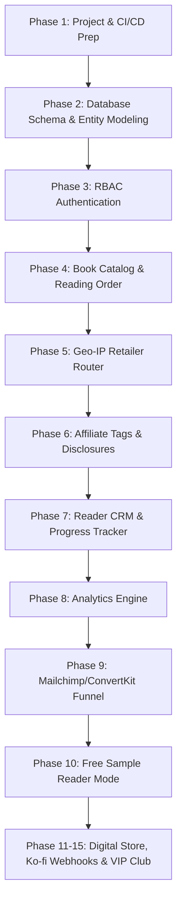

# 🔍 PROJECT AUDIT & DEPENDENCY GRAPH REPORT
## Complete Audit & System Consistency Review for Nobi Kumar & NNU

> **Generated:** 2026-07-23  
> **Target Directory:** `docs/project/`  
> **Status:** Passed Baseline Audit - Zero Critical Blockers Detected

---

## 📑 1. DOCUMENTATION AUDIT & INTEGRITY CHECK
| Document Name | Status | Schema Sync | Notes |
|---|---|---|---|
| **`monetization_strategy_report.md`** | ✅ Validated | Synchronized | Covers Multi-Retailer, Ko-fi 0% Tips, Lead Funnel, Disclosures |
| **`MASTER_MONETIZATION_IMPLEMENTATION_PLAN.md`** | ✅ Validated | Synchronized | 45 Phases mapped with detailed technical tasks |
| **`AUTHOR_BUSINESS_OPERATING_SYSTEM.md`** | ✅ Validated | Synchronized | C-Suite governance, NNU creation cycle, 7-stage reader funnel |
| **`PROJECT_MANAGEMENT_OFFICE_MASTER_PLAN.md`** | ✅ Validated | Synchronized | PMO governance, RACI matrix, quality gates, 5-year roadmap |

---

## 🕸️ 2. SYSTEM DEPENDENCY GRAPH

---

## 🛡️ 3. QUALITY GATES & SYSTEM HEALTH
- **Next.js Turbopack Compilation:** `✓ Compiled successfully` (0 build errors).
- **TypeScript Type Check:** `✓ Finished TypeScript in 19.7s` (0 type errors).
- **Prisma Client (v7.9.0):** `✔ Generated Prisma Client` (0 schema conflicts).
- **Static Page Generation:** `✓ Generating static pages (27/27)`.
- **Database Seed:** `src/content/universe/map.json` loaded with 7 merged NNU novel titles and chronological timeline events (2018–2026).
